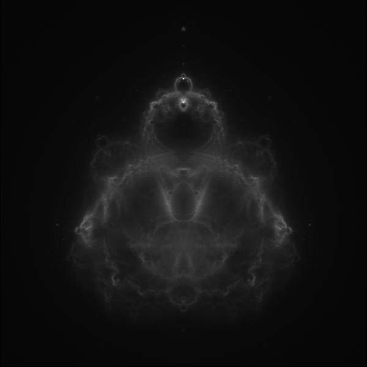

  

# Buddhabrot Renderer (Caltech CS11 Advanced C++ – Final Lab 3 Solution)

This repository contains my final solution for the three-part **Buddhabrot Renderer** labs (Parts 1–3) from the **Caltech CS11 Advanced C++** track. The code implements a complete Buddhabrot renderer for the Mandelbrot set, as specified in the lab handouts. 

- **Part 1**: Start the Buddhabrot program and implement the basic rendering technique for the Mandelbrot set. 
- **Part 2**: Extend the program so it can render full images using the Buddhabrot technique. 
- **Part 3**: Finish the program, with emphasis on code cleanup (“beautification”) and improving usability using standard C/C++ programming techniques. 

This repository reflects the **final Lab 3 version**, which includes everything required from Parts 1 and 2 plus the refinements from Part 3.

---

## What the Program Does

At a high level, the renderer:

- Samples points in the **complex plane** as candidate values for the Mandelbrot iteration. 
- Iterates the standard Mandelbrot recurrence \($z_{n+1} = z_n^2 + c$) for each sample and determines whether it **escapes**.  
- For escaping points, records the **orbit** (the sequence of complex values visited during iteration).  
- Maps the orbit back onto the image plane, updating a **density/histogram** of how often each pixel is visited.  
- Converts the final histogram into an image file, producing a Buddhabrot visualization of the Mandelbrot set. 

All of these steps correspond directly to the Buddhabrot rendering technique described in the lab handouts.

---

## Lab-Specific Challenges

### Part 1 – Core Buddhabrot Rendering

Challenges addressed:

- Implementing Mandelbrot iteration and **escape detection** for many random initial points. 
- Choosing a region of the complex plane and mapping it to pixel coordinates in the output image.
- Accumulating visit counts for pixels based on which points’ orbits pass through them.
- Producing a first working Buddhabrot-style image from the collected data.

### Part 2 – Complete Image Generation

By the end of Part 2, the program can **render complete images using the Buddhabrot technique**. 

Additional challenges include:

- Recording and replaying **full escape orbits** to update the image histogram.
- Managing the number of samples and iteration limits to get a visible image.
- Normalizing or scaling the histogram values so the image uses the available brightness range.
- Organizing the code so the sampling, iteration, and image output logic are clearly separated.

### Part 3 – Finishing, Cleanup, and Usability

According to the lab description, Part 3 focuses on: 

- **Finishing** the Buddhabrot rendering program.
- **Code beautification**: improving clarity, structure, and style.
- **Usability improvements** using standard C/C++ techniques (for example, clearer program structure, better handling of options or parameters, and more user-friendly behavior as directed by the lab).

The code in this repository is the final version that incorporates these refinements.

---

## Building and Running

The labs use a standard `make`-based build system.

    make
    ./bbrot -s <image_size> -p <num_samples> - i <max_iterations> -t <num_threads>

Example invocations (from the lab handouts):

    ./bbrot
    ./bbrot -s 600 -p 50000000 -i 5000 -t 5 > sample_image.pgm

- `<image_size>` – image dimension in pixels (e.g., 600, 1000)  
- `<num_samples>` – number of random sample points to trace  
- `<max_iterations>` – maximum Mandelbrot iterations per sample  
- `<num_threads>` – number of threads to use
